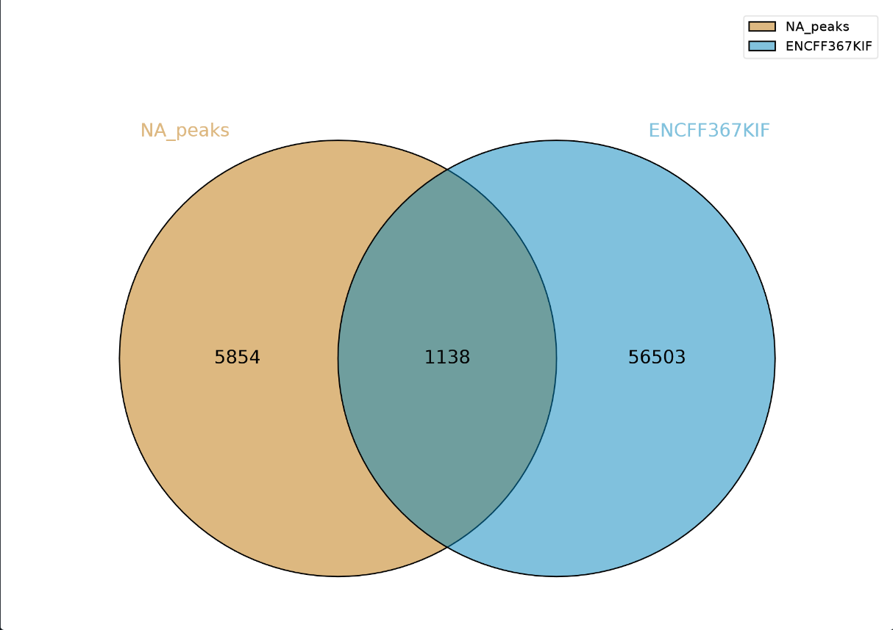
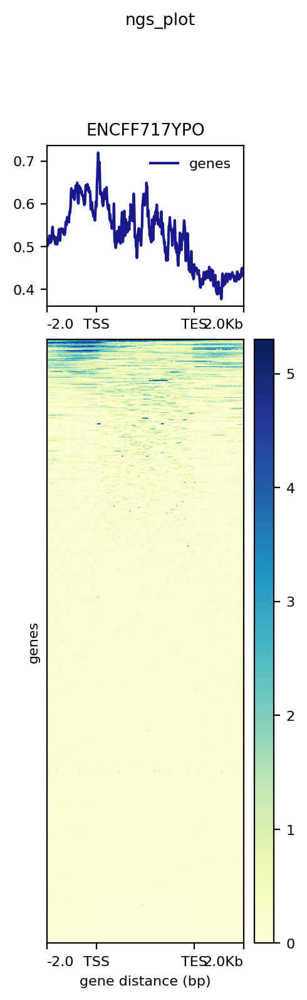

# hse_hw2_chip
- [x] Клеточная линия "Panc1"
- [x] Гистоновая метка "H3K4me3"
- [x] Реплика 1 "ENCFF000VIV"
- [x] Реплика 2 "ENCFF000VIX" 
- [x] Контроль "ENCFF000VJK" 
- [x] Хромосома 19 
## Ссылка на колаб:
```
https://colab.research.google.com/drive/12-qelkrRcmU7LBn52GyvvAMxoQs7JAqa?usp=sharing
```
## Venn

Venn 1 | Venn 2 
--- | --- 
 |  


## NGS 

